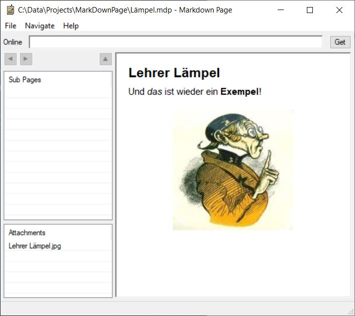

# Markdown Page
Markdown is an excellent text format. But in many cases you want to include images. 
This is an attempt to come up with a file format that comprises them.  

A Markdown Page is simply a Markdown text file inside a `zip` together with embedded pictures:

	Page.mdp
	    Text.md
        Picture.jpg
        Another Picture.jpg
	
This Python app `markdownpage.py` allows to display an `.mdp` file on Windows.  

There is also a little server which allows to publish Markdown Pages on a remote 'site'.  
They can be browsed inside `markdownpage.py`.  

